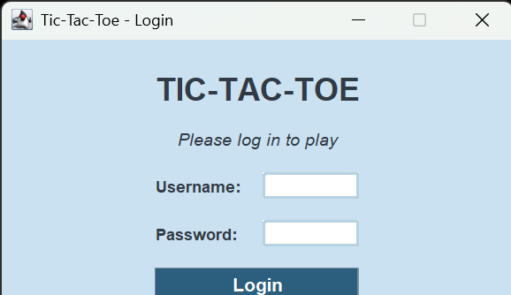
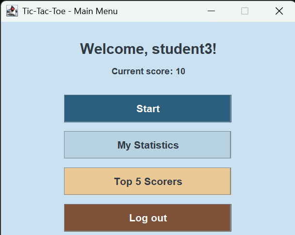
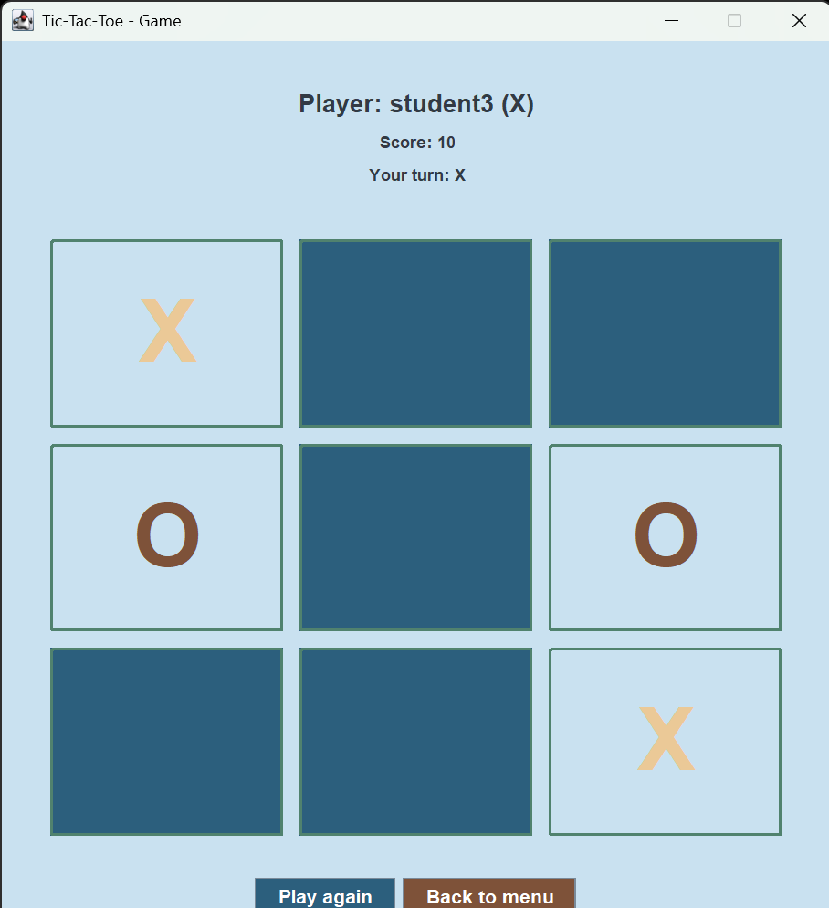
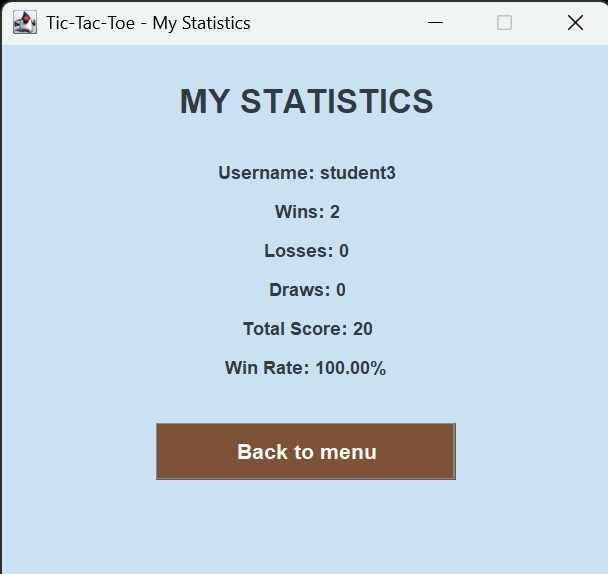
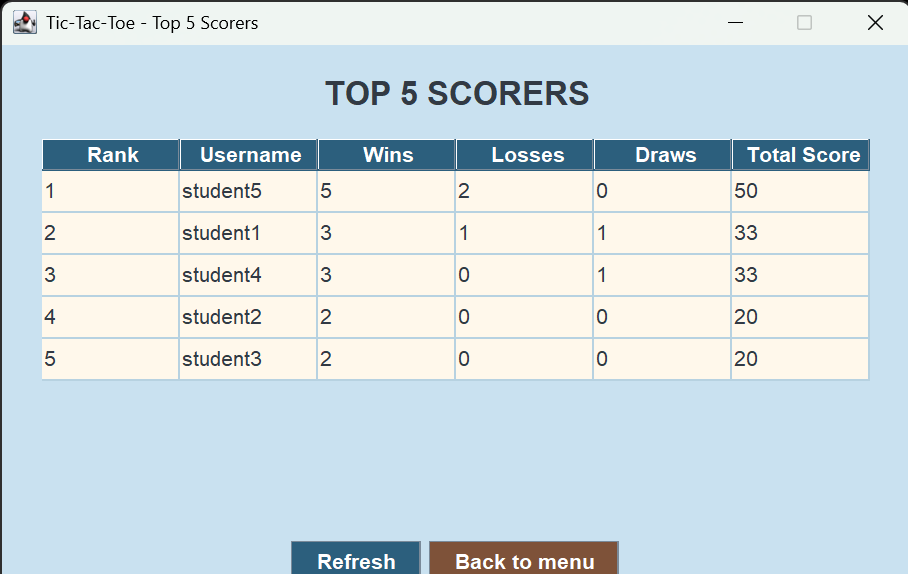

# Simple Tic-Tac-Toe Game with Java Swing, Login, and Statistics

## Student Information
Name: NAVITA FITRIANTI REFANI

Student ID: 5026251041

Class: A

## Project Description
This project is a simple Tic-Tac-Toe game built using Java Swing.
The application includes login, game statistics, and Top 5 scorer
feature.

## Features
- Player login using PostgreSQL database
- Tic-Tac-Toe game using Java Swing GUI
- Player plays as **X**
- Computer plays as **O**
- Automatic game result detection:
  - Win
  - Loss
  - Draw
- Automatic update of wins, losses, draws, and score
- Personal player statistics page
- Top 5 players leaderboard using `JTable`
- Refresh leaderboard data
- Blue, cream, and brown user interface theme
- PostgreSQL database connection using JDBC

## Score Calculation

The player's score is updated automatically after each completed game based on the following rules:

| Result | Score Change |
|---------|-------------:|
| Win | +10 points |
| Draw | +3 points |
| Lose | +0 points |

The game statistics are also updated automatically after every match:
- **Win** → Wins +1
- **Draw** → Draws +1
- **Lose** → Losses +1
  
## Database
Database used: PostgreSQL

This project follows the one-table rule by using only one table named `players`.

| Column Name | Data Type | Description |
|---|---|---|
| `id` | `SERIAL` | Primary key for each player |
| `username` | `VARCHAR(50)` | Unique username used for login |
| `password` | `VARCHAR(100)` | Player password |
| `wins` | `INTEGER` | Total number of wins |
| `losses` | `INTEGER` | Total number of losses |
| `draws` | `INTEGER` | Total number of draws |
| `score` | `INTEGER` | Total player score |

Use the following SQL query to create the table:

```sql
CREATE TABLE players (
    id SERIAL PRIMARY KEY,
    username VARCHAR(50) UNIQUE NOT NULL,
    password VARCHAR(100) NOT NULL,
    wins INTEGER DEFAULT 0,
    losses INTEGER DEFAULT 0,
    draws INTEGER DEFAULT 0,
    score INTEGER DEFAULT 0
);

INSERT INTO players (username, password, wins, losses, draws, score)
VALUES
('student1', '12345', 0, 0, 0, 0),
('student2', '12345', 0, 0, 0, 0),
('student3', '12345', 0, 0, 0, 0);
```

## How to Run

### Step 1: Create the Database

1. Open **PostgreSQL** using **pgAdmin**, **DBeaver**, or **psql**.
2. Create a new database named:

```sql
game_project
```

3. Open the SQL file:

```text
database/schema.sql
```

4. Execute the SQL script to create the `players` table and insert the sample player data.

---

### Step 2: Open the Project

1. Open **IntelliJ IDEA**.
2. Select **Open**.
3. Choose the project folder.
4. Wait until Maven finishes downloading all required dependencies.

---

### Step 3: Configure Database Connection

Open:

```text
src/DatabaseManager.java
```

Update the database configuration according to your PostgreSQL installation.

```java
private static final String URL =
        "jdbc:postgresql://localhost:5433/game_project";

private static final String USER =
        "postgres";          // Your PostgreSQL username

private static final String PASSWORD =
        "your_password";     // Your PostgreSQL password
```

> **Note:**  
> Change the port number if your PostgreSQL server uses a different port (e.g., `5432` instead of `5433`).

---

### Step 4: Run the Program

Run:

```text
src/Main.java
```

Login using one of the sample accounts:

| Username | Password |
|----------|----------|
| student1 | 12345 |
| student2 | 12345 |
| student3 | 12345 |

After logging in, you can:
- Start a Tic-Tac-Toe game against the computer.
- View your personal statistics.
- View the Top 5 Players leaderboard.
   
## Class Explanation

| Class | Description |
|--------|-------------|
| **Main** | The main class of the application. It starts the program by opening the login window. |
| **DatabaseManager** | Manages the connection between the Java application and the PostgreSQL database using JDBC. |
| **Player** | Represents player data, including ID, username, password, wins, losses, draws, and score. |
| **PlayerService** | Handles database operations related to players, including login validation, retrieving player data, updating game statistics, and retrieving the Top 5 players. |
| **GameLogic** | Handles the Tic-Tac-Toe game logic, including the game board, player moves, computer moves, win detection, draw detection, and game reset. |
| **LoginFrame** | Provides the login interface. It validates the username and password using `PlayerService` before opening the main menu. |
| **MainMenuFrame** | Displays the main menu after a successful login. It provides navigation to start a game, view personal statistics, view the Top 5 players, or log out. |
| **GameFrame** | Displays the Tic-Tac-Toe game board. The player uses **X**, while the computer uses **O**. This class updates the game result and player statistics after each completed game. |
| **StatisticsFrame** | Displays the logged-in player's personal statistics, including wins, losses, draws, score, and win rate. |
| **TopScorersFrame** | Displays the Top 5 players based on score using `JTable`. It also provides a refresh button to reload the latest leaderboard data. |
  
## Screenshots

### Login Window

<p align="center">
  
</p>

### Main Menu

<p align="center">
  
</p>

### Game Window

<p align="center">
  
</p>

### Statistics Window

<p align="center">
  
</p>

### Top 5 Players

<p align="center">
  
</p>

## Links

YouTube: https://youtu.be/Z6bVuzj8n4A

